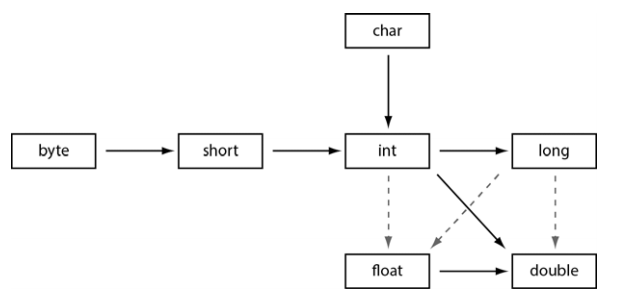

# Java podstawy

## 2. Środowisko programistyczne Javy

### Kompilacja i uruchamianie programów


```
javac Welcome.java
java Welcome
```

## 3. Podstawowe elementy języka Java

### 3.3 Typy danych

```

int     4 bajty     -2mld - 2mld
short   2 bajty     -32768 - 32767
long    8 bajtów    
byte    1 bajt      -128 - 127
float   4 bajty     około ±3,40282347E+38F (6 – 7 znaczących cyfr dziesiętnych)
double  8 bajtów    około ±1,79769313486231570E+308 (15 znaczących cyfr dziesiętnych)
```

```
char - można zapisywać jako kody unicode w zakresie od \u0000 do \uFFFF
```

#### 3.5.2 Konwersja typów numerycznych

Strzałki przerywane - konwersja mogąca powodować utratę danych




#### 3.5.9 Typ wyliczeniowy Enum

* Jest klasą posiadającą określoną liczbę instancji
* Dziedziczy po Enum
* Można używać jako argument `switch`

```java
enum Size {
    SMALL("SM"), MEDIUM("M"), LARGE("L")
    
    private String abbrv;
    
    private Size(String abbr){
        this.abbrv = abbrv;
    }
    
    public String getAbbrv(){
        return this.abbrv;
    }
}
```

### Lańcuchy

* Są niemodyfikowalne (immutable)
* Dwa te same łańcuchy mogą być w rzeczywistości jednym w pamięci


Przydatne metody

```java
int compareTo(String other) //Zwraca wartość ujemną, jeśli łańcuch znajduje się przed innym (other) łańcuchemw kolejności słownikowej

String join("delimiter", CharSequence... elements) //Zwraca nowy łańcuch będący połączeniem wszystkich elementów za pomocą określonego znaku.

```

### 3.7.1. Odbieranie danych wejściowych

```java
Scanner in = new Scanner(System.in);
System.out.print("Jak się nazywasz? ");
String name = in.nextLine(); // wczytuje linię w której mogą być spacje
String firstName = in.next(); // wczytuje pojedyncze slowo ogranicozne spacjami
int age = in.nextInt();

// Pobieranie hasła z konsoli
Console cons = System.console();
String username = cons.readLine("Nazwa użytkownika: ");
char[] passwd = cons.readPassword("Hasło: ");
```

### 3.7.3. Zapis i odczyt plików

```java
//Czytanie zawartości pliku
Scanner in = new Scanner(Paths.get("mojplik.txt"));

// Zapis do pliku
PrintWriter out = new PrintWriter("file.txt");
```

### 3.8.5. Wybór wielokierunkowy — instrukcja switch

Etykiety case mogą być:
* wyrażeniami stałymi typu char, byte, short lub int;
* stałymi wyliczeniowymi;
* literałami łańcuchowymi od Java SE 7

## 3.9. Wielkie liczby 

```java
BigInteger a = BigInteger.valueOf(100); // Konwersja int na BigInteger
   
a.add(BigInteger.valueOf(44)); // Wszystkie operacje realizowane przez metody

BigDecimal bd = BigDecimal.valueOf(23.34);
```

## 3.10. Tablice

* Można deklarować tablice postrzępione

```java
int[] smallPrimes = { 2, 3, 5, 7, 11, 13 };

//Kopiowanie tablicy
int[] sm2 = Arrays.copyOf(smallPrimes, smallPrimse.length);

//Sortowanie
Arrays.sort(sm2);

//Konwersja na piekny string
String arr = Arrays.toString(sm2);

//Wypelnia tablice elementami
Arrays.fill(sm2, 1);

//Porównanie tablic
boolean equal = Arrays.equals(sm2, smallPrimes);

//Tablica wielowymariowa
int[][] magicSquare =
 {
 {16, 3, 2, 13},
 {5, 10, 11, 8},
 {9, 6, 7, 12},
 {4, 15, 14, 1}
};

//Konwersja na piekny string
String arr = Arrays.deepToString(magicSquare);
```

# 4. Obiekty i klasy