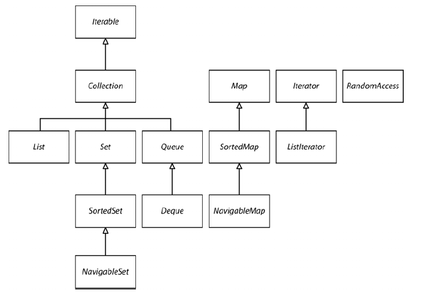
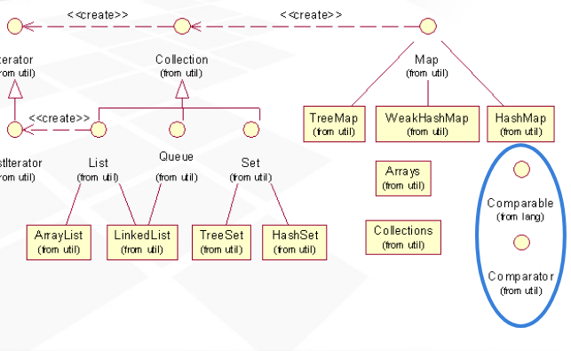

# Java podstawy

# 2. Środowisko programistyczne Javy

## 2.2. Używanie narzędzi wiersza poleceń

```
// kompilacja plików - utowrzy plik Welcome.class
javac Welcome.java 

// uruchomienie maszyny wirtualnej i wykonanie kodu bajtowego z pliku Welcome.class
java Welcome
```


# 3. Podstawowe elementy języka Java

### 3.3 Typy danych

Liczby można zapisywać używając separatora _ np 1_000 //java 7+

Typy całkowite
```
byte    1 bajt      -128 - 127
short   2 bajty     -32768 - 32767
int     4 bajty     -2mld - 2mld
long    8 bajtów    –9 223 372 036 854 775 808 do 9 223 372 036 854 775 807

float   4 bajty     ok ±3,40282347E+38F (6 – 7 znaczących cyfr dziesiętnych) 
double  8 bajtów    ok ±1,79769313486231570E+308 (15 znaczących cyfr dziesiętnych) 
```

```
char - (UTF-16) pojedyńczy znak można zapisywać w kodzie 16-nastkowym w zakresie od \u0000 do \uFFFF 
```

```
Systemy liczb i zapis:
szestnastkowy: 0x.. np 0x34
ósemkowy: 0.. np 023
dwójkowy: 0b.. / 0B... np 0b01 //java 7+
```

#### 3.5.2 Konwersja typów numerycznych

Strzałki przerywane - konwersja mogąca powodować utratę danych


#### 3.5.5. Operatory inkrementacji i dekrementacji

* ++x - wartość x obliczana przed obliczeniem wyrażenia w którym występuje
* x++ - wartość x obliczona po obliczeniu wyrażenia w którym występuje

```java
int m = 7;
int n = 7;
int a = 2 * ++m; // a ma wartość 16, a m — 8
int b = 2 * n++; // b ma wartość 14, a n — 8
```

#### 3.5.7. Operatory bitowe

Operatory bitowe to:

* & bitowa koniunkcja 
* | bitowa alternatywa 
* ^ lub wykluczające 
* ~ bitowa negacja
* \>> przesunięcie bitowe w prawo
* << przesunięcie bitowe w lewo

Przykłady:
```java

// Bitowa koniunkcja
int x = (n & 8) / 8; // x = 1 jeśli 4 bit zmiennej n = 1
(1010 & 1000) - suma logiczna = 1000 = 8 dziesiętnie

// Przesunięcie bitów w praco

7>>1 // 3
0111 >> 1 = 0011 

int a = 5;

// Różnica pomidzy && a &
boolean result = a < 5 & a == 5; // Wykonają się oba porównania a zanim zostanie zwrócony wynik
boolean result = a < 5 && a == 5; // Wykona się tylko pierwsze porównanie a < 5 i zostanie zwrocony wynik

```

#### 3.5.9 Typ wyliczeniowy Enum

* Jest klasą posiadającą określoną liczbę instancji
* Dziedziczy po Enum
* Można używać jako argument `switch`
* Idealny do tworzenia singletonów

```java
enum Size {
    SMALL("SM"), MEDIUM("M"), LARGE("L")
    
    private String abbrv;
    
    private Size(String abbr){
        this.abbrv = abbrv;
    }
    
    public String getAbbrv(){
        return this.abbrv;
    }
}

// Przykład singletona

enum SingleObject {
    INSTANCE;
    
    public int getId(){
        return 1;
    }
}
```

```java
    Enum.valueOf(Class enumClass, String name) //Zwraca stałą wyliczeniową danej klasy o podanej nazwie.
    
    Size.SMALL.ordinal() // Zwraca położenie w deklaracji enum (licząc od zera) stałej wyliczeniowej.
    
```

## 3.6 Lańcuchy - Strings

* Immutable
* Dwa te same łańcuchy mogą być w rzeczywistości jednym w pamięci (tylko stałe łancuchowe, powstałe w wyniku operacji już nie) tzw. String pool
* składają się z szeregu znaków Unicode.

```java
char a = "afls".charAt(1); // należy uważać ponieważ pobrany znak może być zapisany w 2 jednostkach kodowych UTF-16
```


Przydatne metody

```java
int compareTo(String other) //Zwraca wartość ujemną, jeśli łańcuch znajduje się przed innym (other) łańcuchemw kolejności słownikowej

String join("delimiter", CharSequence... elements) //Zwraca nowy łańcuch będący połączeniem wszystkich elementów za pomocą określonego znaku.

```

#### 3.6.9. Składanie łańcuchów - Strings

Za każdym razem, gdy łączone są znaki, tworzony jest nowy obiekt klasy String.

```java
StringBuilder sb = new StringBuilder();
sb.append("aa");
String completedString = builder.toString();

// Bezpieczna wątkowo wersja - wolniejsza bo metody są synchronizowane
StringBuffer sb = new StringBuffer();
```

### 3.7.1. Odbieranie danych wejściowych

```java
Scanner in = new Scanner(System.in);
System.out.print("Jak się nazywasz? ");
String name = in.nextLine(); // wczytuje linię w której mogą być spacje
String firstName = in.next(); // wczytuje pojedyncze slowo ogranicozne spacjami
int age = in.nextInt();

// Pobieranie hasła z konsoli
Console cons = System.console();
String username = cons.readLine("Nazwa użytkownika: ");
char[] passwd = cons.readPassword("Hasło: ");
```

#### 3.7.2. Formatowanie danych wyjściowych

```java
System.out.printf("%d - liczba całkowita dziesiętna", 10); // 10
System.out.printf("%x - liczba całkowita szesnastkowa", 159); // 9f
System.out.printf("%o - liczba całkowita ósemkowa", 159); // 237
System.out.printf("%f - liczba zmiennoprzecinkowa", 1.1); // 1.1
System.out.printf("%e - liczba zmiennoprzecinkowa w notacji wykładniczej", 159); // 1.59e+01
System.out.printf("%s - łańcóch", "aa"); // aa
System.out.printf("%c - znak", 'h'); // h
System.out.printf("%b - wartość logiczna", true); // true
System.out.printf("%h - wartośc skrótu", 'h'); // 68

Dodatkowo można modyfikować wygląd formatowanych danych znakami specjalnymi:


Aby utoworzyć ale nie drukować napisu należy użyć metody `Strinf.format("%d", 10)`

```

### 3.7.3. Zapis i odczyt plików

```java
//Czytanie zawartości pliku
Scanner in = new Scanner(Paths.get("mojplik.txt"),"UTF-8");

// Zapis do pliku
     try(PrintWriter pn = new PrintWriter("aample.txt")){
            pn.print("Jakis napis");
        }catch (IOException ex){
            ex.printStackTrace();
        }
```

### 3.8.5. Wybór wielokierunkowy — instrukcja switch

Etykiety case mogą być:
* char, byte, short, int, enum, String (od Java 7);

## 3.9. Wielkie liczby 

```java
BigInteger a = BigInteger.valueOf(100); // Konwersja int na BigInteger
   
a.add(BigInteger.valueOf(44)); // Wszystkie operacje realizowane przez metody

BigDecimal bd = BigDecimal.valueOf(23.34);
```

## 3.10. Tablice

* Można deklarować tablice postrzępione

```java
// Dwa sposoby na inicjalizację tablicy
int[] smallPrimes = { 2, 3, 5, 7, 11, 13 };
int[] smallPrimes = new int[]{ 2, 3, 5, 7, 11, 13 };

//Kopiowanie tablicy
int[] sm2 = Arrays.copyOf(smallPrimes, smallPrimse.length);

//Sortowanie
Arrays.sort(sm2);

Array.sort(arr, Comparator) - tylko dla obiektów

//Konwersja na piekny string
String arr = Arrays.toString(sm2);

//Wypelnia tablice elementami
Arrays.fill(sm2, 1);

//Porównanie tablic
boolean equal = Arrays.equals(sm2, smallPrimes);

//Tablica wielowymariowa
int[][] magicSquare =
 {
 {16, 3, 2, 13},
 {5, 10, 11, 8},
 {9, 6, 7, 12},
 {4, 15, 14, 1}
};

//Konwersja na piekny string
String arr = Arrays.deepToString(magicSquare);

//Iteracja za pomocą pętli foreach
for(int item : arr){
    System.out.println(item);
}

// Można deklarować tablicze postrzępione w javie
```

# 4. Obiekty i klasy

* getter powinien zwracać klon obiektu, jeśli ten nie jest immutable

### 4.2.2. Klasa LocalDate

* immutable ( w przeciwieństwie do Date )
* posiada dużo przydatnych metod jak możliwość dodawania dni itp do daty

```java
LocalDate date = LocalDate.now();
LocalDate newYearsEve = LocalDate.of(1999, 12, 31);
int year = newYearsEve.getYear(); // 1999
int month = newYearsEve.getMonthValue(); // 12
int day = newYearsEve.getDayOfMonth(); // 31

LocalDate aThousandDaysLater = newYearsEve.plusDays(1000);

```

### 4.3.9. Stałe jako pola klasy

```java
public final String SIZE:
```

Stała OBIEKTOWA musi być zainicjowana przy deklaracji lub w każdym konstruktorze klasy

### 4.4.4. Metody fabryczne

Statyczna metoda używana do tworzenie instancji obiektu

* w przeciwieństwie do konstruktora może mieć nazwę
* mogą zwracać inne klasy np podklasy


## 4.5. Parametry metod
 
 W Javie zawsze stosowane są wywołania przez wartość. W przypadku obiektów przekazywana jest kopia referencji do obiektu.
 
* Metoda nie może zmodyfikować parametru typu podstawowego (czyli będącego liczbą lub wartością logiczną).
* Metoda może zmienić stan obiektu przekazanego jako parametr.
* Metoda nie może sprawić, aby parametr obiektowy zaczął się odwoływać do nowego obiektu. 
 
## 4.6.2. Domyślna inicjalizacja pól

Pola w przeciwieństwie do zmiennych lokalnych są inicjalizowane domyślnymi wartościami - nie nalezy na tym polegać!

## 4.6.3. Konstruktor bezargumentowy

 Jest defaultowo dostępny, chyba że klasa posiada jaki kolwiek inny konstruktor.

## 4.6.6. Wywoływanie innego konstruktora
 
 ```java
public Employee(double s)
{
     // Wywołuje Employee(String, double)
    this("Employee #" + nextId, s);
    nextId++;
}
```

## 4.6.7. Bloki inicjalizujące
* Wykonywany przed konstruktorem
* Wykonywane w kolejności w jakiej są zadeklarowane
* Statyczny blok wykonywany przy pierwszym załadowaniu klasy

Kolejność:
1 Statyczny blok rodzica
2 Statyczny blok dziecka
3 Blok rodzica
4 Blok dziecka
5 Konstruktor

```java
class Employee
{
    private static int nextId;
    private int id;
    private String name;

    // Blok inicjalizujący obiektu.
    {  
        id = nextId;
        nextId++;
    }
    
    // statyczny blok inicjujący
    static
    {
     Random generator = new Random();
     nextId = generator.nextInt(10000);
    }
    
    public Employee(String n, double s)
    {
        name = n;
        salary = s;
    }

}
```

## 4.6.8. Niszczenie obiektów i metoda finalize
* wywoływana przed usunięciem obiektu przez system zbierania nieużytków
* `System.runFinalizersOnExit(true)` - gwarantuje, że metody finalizujące zostaną wywołane przed zakończeniem programu.
```java
   @Override
    protected void finalize() throws Throwable {
        super.finalize();
    }
```

## 4.7. Pakiety
* Kompilator nie rozpoznaje żadnych powiązań pomiędzy pakietami i podpakietami
* Kompilacja nie wymaga aby klasy były w katalogach odpowiadająch pakietom, ale uruchomienia programu już tak

### 4.7.4. Zasięg pakietów
* W JDK 1.2 wprowadzono zmiany w mechanizmie ładującym klasy (ang. class loader), aby jawnie zabraniał ładowania klas użytkownika, których pakiety mają nazwy zaczynające się od słowa java..

### 4.9.7. Generowanie dokumentacji

javadoc -d <targetDirectory> *.java

## 4.8. Ścieżka klas 
Miejsca w których będą szukane klasy wymagane do uruchomienia programu

* Sciezka klas powinna zawwierac biezacy katalog . inaczej javac sobie poradzi natomiast java nie

* W systemie UNIX poszczególne elementy ścieżki klas są rozdzielane dwukropkiem:
/home/user/classdir:.:/home/user/archives/archive.jar
* W systemie Windows separatorem jest średnik:
c:\classdir;.;c:\archives\archive.jar

* Wszystkie pliki JAR (ale nie .class) znajdujące się w katalogu archives są dodawane do ścieżki klas.
* Pliki biblioteczne wykonawcze (plik rt.jar i inne pliki JAR, które znajdują się w katalogach jre/lib i jre/lib/ext) są zawsze p

ustawienia sciezkli klas przy uruchomieniu programu:

```java
java -classpath c:\classdir;.;c:\archives\archive.jar MyProg
java -cp c:\classdir;.;c:\archives\archive.jar MyProg
```

## 4.10. Porady dotyczące projektowania klas

* Dane powinny być prywatne.
* Dane powinny być zawsze zainicjalizowane.
* Nie należy stosować zbyt wielu różnych podstawowych typów danych w jednej klasie. Ponizej pola klasy Customer mozna zamienic na klase Address
```java
private String street;
private String city;
private String state;
private int zip;
```
* Nie wszystkie pola wymagają własnych metod dostępu i zmiany.
* Klasy o zbyt dużej funkcjonalności powinny być dzielone.
* Preferuj klasy niezmienne.

# Dziedziczenie

## 5.1.5. Polimorfizm

Która metoda zostnie wywowałana zależy od rzeczywistego typu parametru niejawnego (this) methody. Wiązanie dynamiczne

```java
        class A {
            public void print() {
                System.out.println("A");
            }
        }

        class B extends A {
            public void print() {
                System.out.println("B");
            }
        }

        A[] arr = {new A(), new B()};

        arr[0].print(); // prints A
        arr[1].print(); // prints B
```

## 5.1.7. Wyłączanie dziedziczenia — klasy i metody finalne
* nie można dziedziczyć po klasach finalnych 
* nie mozna przesłaniać finalnych metod w podklasach

# 5.2. Kosmiczna klasa wszystkich klas — Object

* jeśli A.equals(B) == true to A.hashCode == B.hashCode
* jeśli A.hashCode() == B.hashCode() to PRAWDOPODOBNIE A.equals(B) == true

### Metoda equals

*  `Objects.equals(a, b)` -  zwraca true, jeśli oba argumenty są null, false — jeśli jeden z argumentów jest null, a w pozostałych przypadkach wywołuje a.equals(b)
* Jeśli przedefiniujesz metodę equals w podklasie, użyj odwołania super.equals(other).

```java
 @Override
 public boolean equals(Object otherObject)
 {
     
     // Szybkie sprawdzenie, czy obiekty są identyczne.
    if (this == otherObject) return true;
    
    // Musi zwrócić false, jeśli parametr jawny ma wartość null.
    if (otherObject == null) return false;
        
    // Jeśli klasy nie pasują, nie mogą być równe.
    if (getClass() != otherObject.getClass())
    return false;
    
    // Wiadomo, że otherObject nie jest obiektem null klasy Employee.
    Employee other = (Employee) otherObject;
    
    // Sprawdzenie, czy pola mają identyczne wartości.
    return salary == other.salary
    && Objects.equals(this.hireDay, other.hireDay);
 }

 Specyfikacja języka Java wymaga, aby metoda equals miała następujące własności:
 
* Zwrotność: x.equals(x) powinno zwracać true, jeśli x nie ma wartości null.
* Symetria: dla dowolnych referencji x i y, x.equals(y) powinno zwrócić wartość true wtedy i tylko wtedy, gdy y.equals(x) zwróci wartość true.
* Przemienność: dla dowolnych referencji x, y i z, jeśli x.equals(y) zwraca wartość true i y.equals(z) zwraca true, to x.equals(y) zwraca tę samą wartość.
* Niezmienność: jeśli obiekty, do których odwołują się zmienne x i y, nie zmieniły się, kolejne wywołania x.equals(y) zwracają tę samą wartość.
* Dla każdego x różnego od null, wywołanie x.equals(null) powinno zwrócić
  wartość false.

```

### Metoda hashCode

* Objects.hashCode, która zwraca 0, jeśli jej argument jest null, albo wynik wywołania hashCode na tym argumencie
* Objects.hash(Object... obj) - Zwraca wartość skrótu będącą kombinacją wartości skrótu wszystkich podanychobiektów.

* static int hashCode(typ[] a)  Oblicza skrót tablicy a, która może przechowywać elementy następujących typów: Object, int, long, short, char, byte, boolean, float, double.

```java
public int hashCode()
{  
     return 7 * Objects.hashCode(name)
      + 11 * Double.hashCode(salary)
      + 13 * Objects.hashCode(hireDay);
 }
```

### Metoda toString

```java
public String toString()
{
    return getClass().getName()
    + "[name=" + name
    + ",salary=" + salary
    + ",hireDay=" + hireDay
    + "]";
}
```


## 5.4. Opakowania obiektów i automatyczne pakowanie
* Nazwy klas opakowujących: Integer, Long, Float, Double, Short, Byte, Character, Void i Boolean (sześć pierwszych dziedziczy po wspólnej nadklasie Number)

```java
ArrayList<Integer> list = new ArrayList<>(); //duzo wolniejsza od zwyklej tabliczy przez opakowywanie
list.add(3); //automatyczne opakowanie. 

int x = Integer.parseInt(s);
```


# 6 Interfejsy, wyrażenia lambda i klasy wewnętrzne

### Interfejsy
* pola są automatycznie statyczne finalne publiczne
* od J 8 można deifniować i implementowac metody statyczne
* można deifniować i implementować metody default - dzięki temu klasa nie musi nadpisywać meotdy interfejsu jeśli nie chcemy go implementować


### 6.2.3. Klonowanie obiektów - clone()
* metoda protected w Object - należy ją nadpisać i dodać zasięg publiczny. Kopiuje pola - jeśli pole to obiekt, kopiowana jest referencja! OK jeśli obiekt jest immutable

* Aby jej używać obiekt musi implementować interfejs Cloneable
* metoda kowariantna - można nadpisać i zmienić typ zwrotny

```java
class Employee implements Cloneable
{
 // Zwiększenie widoczności na public i zmiana typu zwrotnego.
 public Employee clone() throws CloneNotSupportedException
 {
 return (Employee) super.clone();
 }
 . . .
}
```

### 6.3. Wyrażenia lambda
* można używać wszędzie tam gdzie spodziewany jest interfejs funkcjonalny - z jedną metodą publiczną
* funkcjonalny interfejs może posiadać defaultowe i statyczne meteody !
* zmienne użyte z lambdach muszą być finalne lub efektywnie finalne bo lambda może wykonać się kiedy metoda ze zmienną już wykonała
* this w lambdzie odnosi się do obiektu w którym lambda się znajduje a nie do samej lambdy


Przydatne sa w przypadkach:

wykonywanie kodu w osobnym wątku,
* wykonywanie kodu wiele razy,
* wykonywanie kodu w odpowiednim momencie działania algorytmu
(np. w procedurze porównywania algorytmu sortującego),
* wykonywanie kodu w odpowiedzi na jakieś zdarzenie (kliknięcie przycisku,
nadejście danych itd.),
* wykonywanie kodu tylko wtedy, gdy jest to konieczne

```java
@FunctionalInterface
interface Moveable{
    public void move();
}
```


### 6.3.5. Referencje do konstruktorów i metod

Arrays.sort(strings, String::compareToIgnoreCase)
W obu przedstawionych przykładach między nazwą metody a nazwą obiektu lub klasy
znajduje się operator ::. Wyróżnia się trzy podstawowe przypadki:
* obiekt::metodaEgzemplarza,
* Klasa::metodaStatyczna,
* Klasa::metodaEgzemplarza.


```java
ArrayList<String> names = . . .;
Stream<Person> stream = names.stream().map(Person::new);
List<Person> people = stream.collect(Collectors.toList());

// rownowazne
Stream<Person> stream = names.stream().map(x->new Person(x));
```
```java
        String[] arr = {"a"};
        
        //Klasa::metodaEgzemplarza
        //Pierwszy parametr (a) jest tym na którym wykonywana jest metoda
        Arrays.sort(arr, String::compareTo);
        Arrays.sort(arr, (a,b) -> a.compareTo(b));
        
        //Klasa::metodaStatyczna
        Math::pow
        (x, y)-> Math.pow(x, y).
```

### 6.3.7 Interfejsy funkcjonalne

* mogą posiadać metody defaultowe i statyczne


## 6.4. Klasy wewnętrzne

####  klasyczna klasa wewnętrzna

* klasa Inner posiada dostęp do pól klasy Outer
* klasa Inner nie może istnieć poza obiektem Outer
* klasa wewnętrzna ma dostęp do stanu obiektu zewnętrznego jeśli nie jest statyczna
* statyczną klasę wewnętrzną można utworzyć nawet jeśli nie istnieje obiekt klasy zewnętrznej
* tylko statyczna klasa wewnętrzna może zawierać statyczne metody i pola
 
```java
    class Outer {        
        class Inner {
        }
    }
    
    //Tworzenie instancji klasy Inner
    Outer out = new Outer();
    Outer.Inner in = out.new Inner();
```
####  klasa zdefiniowane wewnątrz meotdy
* nie uzywa modyfikatorów public / private
* ma dostęp do zmiennych lokalnych (var)
* zmienne lokalne używane w tej klasie muszą być finalne lub efektywnie finalne, ale można to obejśc przekazując 1 elementową tablicę

```java
    class Outer {

        public void method1(){
            int var = 1;
            
            class Inner {
        
            }
        }
    }
```

#### anonimowe klasy wewnętrzne

```java
    class Outer {

        public void method1(){
            
            Comparable cmp = new Comparable() {
                @Override
                public int compareTo(Object o) {
                    return 0;
                }
            };
        }
    } 
```

Można utworzyć klasę i od razu użyć jej metod w bloku inicjalizacyjnym:
```java
new ArrayList<String>() {{ add("Henryk"); add("Tomasz"); }}
```

# 7. Wyjątki, asercje i dzienniki


*  Error odpowiadają błędom wewnętrznym i wyczerpaniu zasobów w środowisku uruchomieniowym
*  RuntimeException są powodowane przez błędy programisty np:
    * niepoprawne rzutowanie,
    * dostęp do nieistniejącego elementu tablicy,
    * dostęp do pustego wskaźnika

Error i RuntimeException to wyjątki niekontrolowane - nie wymagają przechwytywania.
Wyjątków Error nie powinno się samemu wyrzucać

### 7.2.1. Przechwytywanie wyjątkow

```java
        try{
            // cos tu może wyrzucić wyjątek
        }catch(IOException e){
        }

        // Przechwytywanie kilku wyjątków

        try{
            // cos tu może wyrzucić wyjątek
        }catch(IOException e){

        }catch (EOFException e){

        }

        // Przechwytywanie kilku wyjąktów w jednych catch
        try{
            // Rzucza 2 różne wyjątki
        }catch(IOException | EOFException ex){
            //ex nie można zmienić referencji = ex jest finalne w tym przypadku
        }

        // Klauzura finally
        try{

        }catch(Exception ex){

        }finally {
            // wykona się bez względu czy w try wystąpi wyjątek czy nie
        }

        // Try z zasobami
        try(Resource res = new Resource()){
            // Resource musi implementować AutoCloseable
            // Błędy wyrzucone przez AutoCloseable.close są tłumione
        }catch(Exception ex){
        }

```

## 7.4. Asercje

* wyrzucają AssertionException jeśli się nie powiodą
* są usuwane z kodu finalnego
* aby działały należy uruchmić vm z parametrem -ea lub -enableassertions: `java -enableassertions MyApp`

```java
public void method1(int arg){
    assert arg > 0 : "arg should be greater than 0";
}
```


## 7.5. Dzienniki / Logi

* hierarchia ma znaczenie poniewaz pozwala ustawiac poziom logowania dla nizszych w hierarchii logerow


```java
private static final Logger myLogger = Logger.getLogger("com.mycompany.myapp");

myLogger.setLevel(Level.FINE);
```
Aby zobaczyć jakie klasy są ładowane przy uruchomieniu programu: `java -verbose`
Aby zobaczyć statyczną analize kodu: `javac -Xlint`

Aby śledzić zużycie zasobów przez program: `jconsole IDprocesu`

`-Xprof` - najczesciej używane metody i które zostały skompilowane przez JIT

# Programowanie generyczne

```java
// Prosta klasa generyczna

public class Pair<T,U> {
    private T first;
    private U second;
    
    public T getFirst(){ return first }
}

// Metoda generyczna

public static <T> getMiddle(T... a){
    return a.length;
}

// Ograniczanie zmiennych typowych

public static <T extends Comparable> T min()...

//T musi implementować dany interfejs

// Można dodawać kilka ograniczeń np

public static <T extends Comparable & Serializable> T min()...

// Jeśli wśród typów ograniczających znajduje się klasa to musi znajdować się ona na początku ciągu!

Pair<String> p = (Pair<String>) a; // OSTRZEŻENIE — można tylko sprawdzić, czy a jest typu Pair

Pair<String> stringPair = . . .;
Pair<Employee> employeePair = . . .;
if (stringPair.getClass() == employeePair.getClass()) // są równe
    
    
// Nie wolno tworzyć egzemplarzy zmiennych typowych

public Pair() { first = new T(); second = new T(); } // błąd
    
// Nie można utworzyć egzemplarza generycznej tablicy

public static <T extends Comparable> T[] minmax(T[] a) { T[] mm = new T[2]; . . . } // błąd    

// Zmiennych typowych nie można używać w statycznych kontekstach klas generycznych

public class Singleton<T>
{
    private static T singleInstance; // błąd
    public static T getSingleInstance() // błąd
    {
        if (singleInstance == null) utwórz nowy egzemplarz T
            return singleInstance;
    }
}
    
```

## 8.8. Typy wieloznaczne

```
    public static void printBuddies(Pair<Employee> p)
    //można zastąpić 
    public static void printBuddies(Pair<? extends Employee> p)
    //dzięki temu można przekazać obiekt typu Manager (Manager extends Employee)
```
# Kolekcje

### Interfejs Iterator

```java
public interface Iterator<E>
{
    E next(); // throws NoSuchElementException (<-RuntimeException)
    boolean hasNext();
    void remove(); // Może być użyte tylko po next(); Usuwa element zwrócony przez next();
    default void forEachRemaining(Consumer<? super E> action);
}
```

Każda kolekcja impolmentująca interfejs Iterable może być użyta w pętli foreach

```java
for(E item : Iterable c){
}
```

### Interfejs Iterable

```java
public interface Iterable<E>
{
    Iterator<E> iterator();
    //...
}
```

### Interfejs Collection

```java
public interface Collection<E> extends Iterable<E>
{
    boolean add(E element);
    Iterator<E> iterator();
    //. . .
}
```

AbstractCollection implementuje wszystkie metody interfejsu Collection w kategorii metod. size i iterator pozostały abstrakcyjne

### Interfejsy kolekcji



Lista to kolekcja uporządkowana
Dostęp przez index to dostęp swobodny

### Interfejs ListIterator

Dziedziczy po Iterator i posiada kilka dodatkowych metod związanych z dostępem swobodnym

9.2 Konkretne klasy kolekcyjne





Tablice i listy tablicowe mają jedną poważną wadę — usuwanie elementów z ich środka jest mało efektywne, ponieważ czynność ta wymaga przesunięcia wszystkich elementów znajdujących się za tym usuwanym w stronę początku

### 9.2.3. Zbiór HashSet

Jak przechowywane są elementy:
Pozycja elementu A w HashSet/HashMap (M) to : A.hashCode % M.size
Loadfactor (ok 0.75) - jeśli ilość elementów przekroczy tą wartość to rozmiar kolekcji się zwiększa
Elementy z tym samym hash code porównywane są przez equals przy wstawianiu i przechowywane na tej samem poozycji za pomocą linked listy

* brak zachowanej kolejności

### 9.2.4. Zbiór TreeSet

* Kolejność elementów zachowana
* Trochę wolniejsza od HashSet
* Implementuje klasę SortedSet
* Elementy muszą implementować interfejs Comparable

### 9.2.5. Kolejki Queue i Deque

* queue - dodawanie elementów na końcu i pobieranie z początku
* dequeue - dodawanie i pobieranie elementów z obu stron (ArrayDeque, LinkedList)

### 9.2.6. Kolejki priorytetowe

* Przyjmują elementy w losowej kolejności i oddawaniu ich w kolejności uporządkowanej.
* Realizowana często za pomocą sterty (heap)
* może przechowywać elementy klasy implementującej interfejs Comparable
* metoda remove usuwa najmniejszy element
* iterator nie odwiedza elementów w uporządkowanej kolejności jak w TreeSet

```java
PriorityQueue<GregorianCalendar> pq = new PriorityQueue<>();
```

### 9.3. Słowniki

* podstawowe implementacje: HashMap i TreeMap
* elementy w TreeMap muszę implementować Comparable lub kolekcja musi zostać utworona z komparatorem

### 9.3.3. Widoki słowników

* widok to obiekt implementujący Collection lub pochodne tego interfejsu
```java
Set<K> keySet()
Collection<V> values()
Set<Map.Entry<K, V>> entrySet()
```
* z widoków można usuwać elementy, ale nie można dodawać. Operacja usunięcia będzie odzworowana w mapie

### 9.3.4. Klasa WeakHashMap
* GC usuwa wpisy, jeśli jedyna referencja do klucza wpisu jest w samej mapie. Tzw weak reference

### 9.3.5. Klasy LinkedHashSet i LinkedHashMap
* pamiętają kolejnoś wstawiania do kolekcji elementów
* elementy posiadają referencje do innych elementów, ale w samej mapie i secie znajdują się w "losowej" kolejności
* można nadpisać motodę boolean removeEldestEntry tak żeby usuwała automatycznie najstarszy wpis przy wstawianiu nowego

### 9.3.6. Klasy EnumSet i EnumMap

* EnumSet prosta i wydajna kolekcja do przechowywania enumów
```java
enum Weekday { MONDAY, TUESDAY, WEDNESDAY, THURSDAY, FRIDAY, SATURDAY, SUNDAY };
EnumSet<Weekday> always = EnumSet.allOf(Weekday.class);
EnumSet<Weekday> never = EnumSet.noneOf(Weekday.class);
EnumSet<Weekday> workday = EnumSet.range(Weekday.MONDAY, Weekday.FRIDAY);
EnumSet<Weekday> mwf = EnumSet.of(Weekday.MONDAY, Weekday.WEDNESDAY, Weekday.FRIDAY);
```

* EnumMap - klucze są typu enum. Typ nalezy określić w konstruktorze
```java
EnumMap<Weekday, Employee> personInCharge = new EnumMap<Weekday, Employee>(Weekday.class);
```

### 9.3.7. Klasa IdentityHashMap

Wartości haszowe
kluczy nie powinny być w niej obliczane przez metodę hashCode, ale przez System.
identityHashCode. Metody tej używa metoda Object.hashCode do obliczania skrótu z adresu
obiektu w pamięci. Ponadto klasa ta porównuje obiekty za pomocą operatora == zamiast
metody equals.

## 9.4. Widoki i opakowania

Kolekcja zwraca inną kolekcję ktorej metody operują na elementach oryginalnej kolekcji

### 9.4.1. Lekkie obiekty opakowujące kolekcje
* Arrays.asList tworzy opakowanie na tablicę. Nie  można usuwać i dodawać do niej elementów!
* lista obiektów nie jest duplikowana - oszczędność
* zmiany w tablicy są odwzorowane w widoku
```java
List<String> names = Arrays.asList("Ania", "Bartek", "Karol");
```

### 9.4.2. Przedziały

```java
List group2 = staff.subList(10, 20);
```

* operacje na przdziałach są widoczne w oryginalnej kolekcji - np clear() wyczyści przedział i usunie te elementy z oryginalnej kolekcji

### 9.4.3. Widoki niemodyfikowalne

* Proba modywifkowania tej kolekcji wyrzuca wyjątek
* używją metody equals oryginalnej kolekcji w celu porównywania jej

```java
Collections.unmodifiableCollection
Collections.unmodifiableList
Collections.unmodifiableSet
Collections.unmodifiableSortedSet
Collections.unmodifiableNavigableSet
```

### 9.4.4. Widoki synchronizowane

* metody modyfikujące i dostępowe są synchronizowane w tych widokach

```java
Map<String, Employee> map = Collections.synchronizedMap(new HashMap<String, Employee>());
```

### 9.4.5. Widoki kontrolowane
* Uniemożliwia przemycanie do kolekcji elemntów niezgodnych z generycznym typem

```java
ArrayList<String> strings = new ArrayList<>();
ArrayList rawList = strings; // Zostanie zgłoszone tylko ostrzeżenie (nie błąd) dotyczące
// zgodności ze starszym kodem.
rawList.add(new Date()); // Teraz referencja strings wskazuje na obiekt typu Date!
```
* Próba dodania innego elementu niż string zakończy się wyrzuceniem wyjątku ClassCastException

```java
List<String> safeStrings = Collections.checkedList(strings, String.class);
```

### 9.5. Algorytmy

* Sorotwanie: `Collections.sort(Collection, <Comparator>)
* Tasowanie: `Collections.shuffle()`
* Największy element: `Collections.max(Collection, <Comparator>)`

Przykłady
```java
staff.sort(Comparator.reverseOrder())
staff.sort(Comparator.comparingDouble(Employee::getSalary).reversed())
```

### 9.5.2. Wyszukiwanie binarne

* Działa na posortowanych zbiorach
* Porównuje wyszukiwany element ze znajdującym się w połowie zbioru, dzieląc go w ten sposób na 2 a następnie robi to samo z podzbiorami aż do znalezienie elementu

```java
index = Collections.binarySearch(collection, element);
index = Collections.binarySearch(collection , element, comparator);

result.retainAll(b); // zwraca wspólne elementy zbioru result i b
```

### 9.5.5. Konwersja pomiędzy kolekcjami a tablicami

Tablica > Kolekcja
* zmiany w tablicy widoczne w kolekcji

```java
String[] elements;
List<String> list = Arrays.asList(elements);
```

Kolekcja > Tablica

```java
List<String> list;
Object[] arr1 = list.toArray(); //Nie można rzutować tego na String[]!

String[] arr2 = list.toArray(new String[0]);
String[] arr3 = list.toArray(new String[list.size()]);
```

## 9.6. Stare kolekcje


### 9.6.1. Klasa Hashtable

* Odpowiednik HashMap
* Metody synchronizowane

### 9.6.2. Wyliczenia - Enumeration

* Odpowiednik Iterator
* metody: hasNextElement, nextElement
* Collections.enumeration(col) - zwrace Enumerator kolekcji col

### 9.6.3. Słowniki własności

* Klucze i wartości są łańcuchami.
* Tablicę tę można zapisać w pliku i załadować z pliku.
* Posiada dodatkową tablicę z wartościami domyślnymi.
* implementacja: Properties

```java
        Properties prop = new Properties();
        //properties_example.txt
        //property1=hoho
        prop.load(new FileInputStream(new File("properties_example.txt")));
        System.out.println(prop.getProperty("property1"));
```

9.6.5. Zbiory bitów
//TODO

# 13. Przygotowywanie apletów i aplikacji do użytku

## 13.1. Pliki JAR

* Skompresowane pliki zip

Przygotowanie archiwum

```java
jar cvf CalculatorClasses.jar *.class icon.gif
```

## 13.1.2. Manifest
* Musi kończyć się znakiem nowego wiersza

* Nazwa: MANIFEST.MF
* Zawartość:
```java
Manifest-Version: 1.0
opis całego archiwum
Name: Woozle.class
opis jednego pliku
Name: com/mycompany/mypkg/
opis pakietu
```

* Tworzenie archiwum z plikiem manifestu
```java
jar cfm MyArchive.jar manifest.mf com/mycompany/mypkg/*.class
```

## 13.1.3. Wykonywalne pliki JAR
 * Utowrzenie jar z określeniem klasy startowej

 ```java
 jar cvfe MyProgram.jar com.mycompany.mypkg.MainAppClass pliki do dodania
 ```

 * Określenie klasy startowej w manifeście
 ```java
 Main-Class: com.mycompany.mypkg.MainAppClass
 ```

 ## 13.1.5. Pieczętowanie pakietów
  * Należy dodać do manifestu wpis: Sealed: true przy wybranym pakiecie lub całej aplikacji
  * Do zapieczętowanego pakietu nie można dodawać klas

## 13.2. Zapisywanie preferencji użytkownika

### 13.2.1. Słowniki własności

* Klucze i wartości są łańcuchami.
* Można ją łatwo zapisać w pliku i załadować z niego.
* Istnieje druga tabela przechowująca wartości domyślne.

* Możliwe konfilikty jeśli zainstalujemy kilka aplikacji
* Nie każdy system posiada katalog główny - problem gdzie przechowywać preferencje
```java
Properties settings = new Properties();
settings.put("width", "200");
settings.put("title", "Witaj, świecie!");

// Zapisywanie do pliku
FileOutputStream out = new FileOutputStream("program.properties");
settings.store(out, "Ustawienia programu");

// Odczytywanie z pliku
FileInputStream in = new FileInputStream("program.properties");
settings.load(in);

// Pobranie sciezki do katalogu głównego użytkownika( inne to min. wersja javy, system operacyjny..)
System.getProperty("user.home");


// Pobieranie preferencji z opcjonalną defaultową
settings.getProperty("title", "Domyślny tytuł");

// Defaultowe preferencje - można przekazać do konstruktora inny obiekt Properties
Properties settings = new Properties(defaultSettings);

```

## 13.2.2. API Preferences
 * Tworzy repozytorium w zależnośći od systemu: windows = rejestr, linux = lokalny system plików
 * Struktura drzewiasta jak przy pakietach
 * Nie można zapisać obiektów serializowanych ( obejście: tablica bajtów )

 ```java
 Preferences root = Preferences.userRoot();
 //lub
 Preferences root = Preferences.systemRoot();

 // węzeł
 Preferences node = root.node("/com/mycompany/myapp");

 // Skróty:
 Preferences node = Preferences.userNodeForPackage(obj.getClass());
 Preferences node = Preferences.systemNodeForPackage(obj.getClass());

 // Pobieranie preferencji: (Wartość domyślna jest wymagana!)
 String get(String key, String defval)
 int getInt(String key, int defval)
 long getLong(String key, long defval)
 float getFloat(String key, float defval)
 double getDouble(String key, double defval)
 boolean getBoolean(String key, boolean defval)
 byte[] getByteArray(String key, byte[] defval)

 // Zapisywanie
 put(String key, String value)
 putInt(String key, int value)

 // Pobieranie wszystkich kluczy
 node.keys()

// Importowanie i exportowanie preferencji (xml)
Preferences.importPreferences(InputStream in);
 node.exportNode(new FileOutputStream("backup.xml"));
 ```
 
# 14 Współbierzeność 

### 14.1. Czym są wątki

```java
new Thread(new Runnable(){
    @Override
    public void run(){
        //Kod wykonywany w nowym wątku
    }
}).start();
```

### 14.2. Przerywanie wątków

* Wątek działa do momentu kiedy:
  * Po wykonaniu się metody run lub urzycia w niej return
  * Zostanie w niej wyrzucony nieprzechwycony wyjątek
  
Przerwać wątek można wywołując metodę `interrupt()`. To czy wątek zostanie przerwany zależy tylko od niego `interrupt` = prośba. 
Wyjątek może sprawdzać czy został przerwany: `Thread.currentThread().isInterrupted()`
Jeśli wątek jest zablokowany przez `sleep` lub 'wait' to zostaje wyrzucony wyjątek `InterruptedException`
`interrupted()` sprawdza czy bierzący wątek jest przerwany i zeruje jego status na false.

### 14.3. Stany wątków

* **NEW** <br>
    Utworzony za pomocą `new Thread()`
    
* **RUNNABLE**<br>
    Stan po wykonaniu metody `start()`. Nie oznacza, że wątek jest uruchomiony - to zależy od tego czy system przyznał czas procesora
* **BLOCKED i WAITING**<br>
    Po wywołaniu metod `Object.wait, Thread.join, Lock.tryLock i Condition.wait.`, lub kiedy wątek próbuje założyć blokadę na obiekt

* **TERMINATED**<br>


`Thread.State getState()` - stan wątku: NEW, RUNNABLE, BLOCKED, WAITING, TIMED_WAITING, TERMINATED.

### 14.4. Własności wątków

  #### 14.4.1. Priorytety wątków

  * Domyślnie dziedziczony po rodzicu
  * Ustawiany metodą setPriority(int 1-10)
  * Nie w każdym systemie działają tak samo - mogą być ingnorowane!
  * `yield()` ustępuje innym wątkom o takim samym lub wyższym priorytecie

  #### 14.4.2. Wątki demony
  
  * Służy innym wątkom
  * Nie powinien mieć dostępu do zasobów stałych jak pliki czy baza danych
  * Wątek w demona zmeinia się za pomocą matody `setDaemon(true)`
  * JVM kończy działanie kiedy zostaje tylko wątek demon

  #### 14.4.3. Procedury obsługi nieprzechwyconych wyjątków
  //TODO
 

### 14.5. Synchronizacja

   * Kiedy 2+ wątki chcą dostać się do jednego obiektu to nazywa się race condition

  #### 14.5.3. Obiekty klasy Lock

   * należy uważać aby unlock() zostało zawsze wykonane - inaczej zablokuje to na zawsze inne wątki
   * wątek może wywołać dowolną ilość razy lock() ale żeby odblokować blokadę musi wywołać tyle samo unlock()
  
   ```java
     ReentrantLock myLock = new ReentrantLock();
     myLock.lock();

     try {
         // sekcja krytyczna
     }
     finally {
         myLock.unlock(); // Zapewnienie, że blokada zostanie zdjęta, nawet jeśli wystąpi wyjątek.
     }
   ```
   
   #### 14.5.4. Warunki

//TODO

#### 14.5.5. Słowo kluczowe synchronized

```java
public synchronized void metoda()
{
    //ciało metody
}

// Równoważne:

public void metoda()
{
    this.intrinsicLock.lock();
    try
    {
        //ciało metody
    }
    finally { this.intrinsicLock.unlock(); }
}
```

metody `wait(), notify(), notifyAll()` można używać tylko w sekcji synchronized

```java

        Object monitor = new Object();

        new Thread(()->{
            synchronized (monitor){
                try {
                    monitor.wait();
                } catch (InterruptedException e) {
                    e.printStackTrace();
                }
                System.out.println("Executed thread 1");
            }
        }).start();


        new Thread(()->{
            synchronized (monitor){
                try {
                    Thread.sleep(2000);
                } catch (InterruptedException e) {
                    e.printStackTrace();
                }

                System.out.println("Executed thread 2");
                monitor.notifyAll();

            }
        }).start();

```
//TODO

### 14.6. Kolejki blokujące

* Jeśli kolejka jest wykorzystywana jako narzędzie do zarządzania wątkami, należy używać metod put i take.
* Metody add, remove i element zgłaszają wyjątek, kiedy element jest dodawany do pełnej kolejki lub pobierany z pustej.
* offer, poll i peek, offer =  false przy dodawaniu jeśli pełna, pool/peek = null jeśli jest pusta

Jeden wątek dodaje elementy do kolejki co 1sec i blokuje wątek kiedy kolejka jest pełna. 2 wątek co 3sec ściąga element z kolejki dzięki czemu pierwszy wątek się odblokowywuje i dodaje kolejny element
```java

        BlockingQueue<String> elements = new ArrayBlockingQueue<>(5);

        new Thread(() -> {
            while (true) {
                System.out.println("Adding element");

                try {
                    elements.put(String.valueOf(System.currentTimeMillis()));
                    System.out.println("Elements: " + elements.size());
                    Thread.sleep(500);
                } catch (InterruptedException e) {
                    e.printStackTrace();
                }
            }
        }).start();

        new Thread(() -> {
            while (true) {

                try {
                    System.out.println("Taking element:" + elements.take());
                    Thread.sleep(3000);
                } catch (InterruptedException e) {
                    e.printStackTrace();
                }
            }
        }).start();

```

Implementacje:

* LinkedBlockingQueue - nie posiada określonego rozmiaru ale można go określić
* LinkedBlockingDeque. - dwustronna wersja LinkedBlockingQueue
* ArrayBlockingQueue - ma określony rozmiar i moż austwić aby była uczciwa - farowyzuje dłużej czekające wątki
* PriorityBlockingQueue - elementy usuwane zgodnie z priorytetem (Comparable)
* DelayQueue - implementuje Delayed. Element usuwany dopiero gdy upłynie czas zwracany przez getDelay

### 14.7. Kolekcje bezpieczne wątkowo

* ConcurrentHashMap, 
* ConcurrentSkipListMap, 
* Concurrent SkipListSet
* ConcurrentLinkedQueue.

* mappingCount() - rozmiar tablicy jako long

### 14.8. Interfejsy Callable i Future
### 14.9. Klasa Executors
### 14.10. Synchronizatory
### 14.11. Wątki a biblioteka Swing


